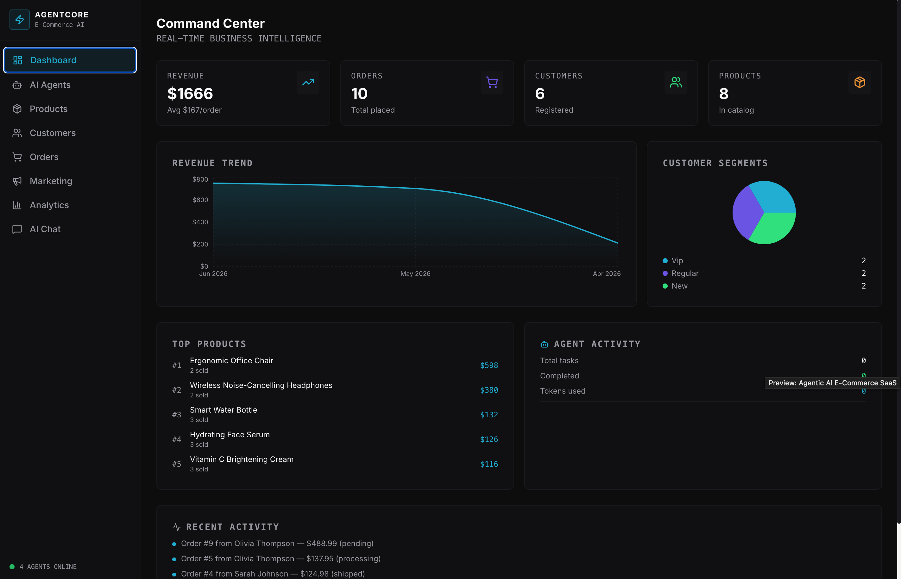
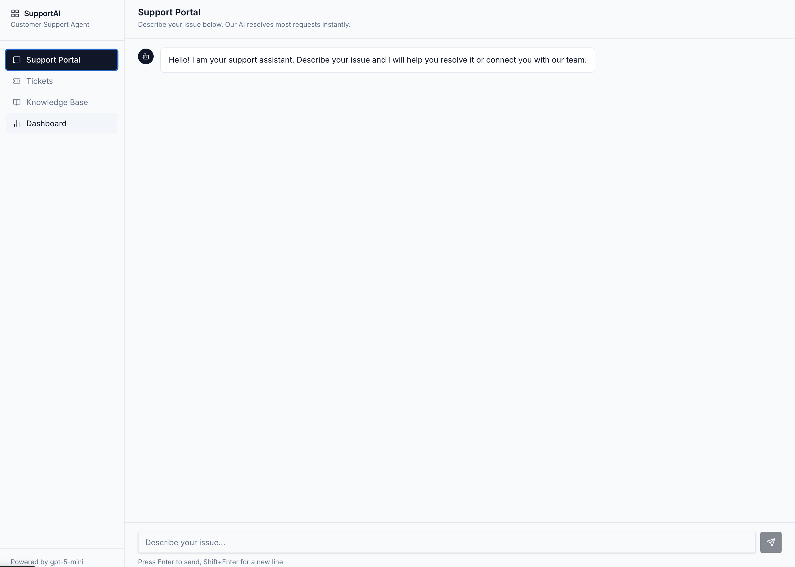
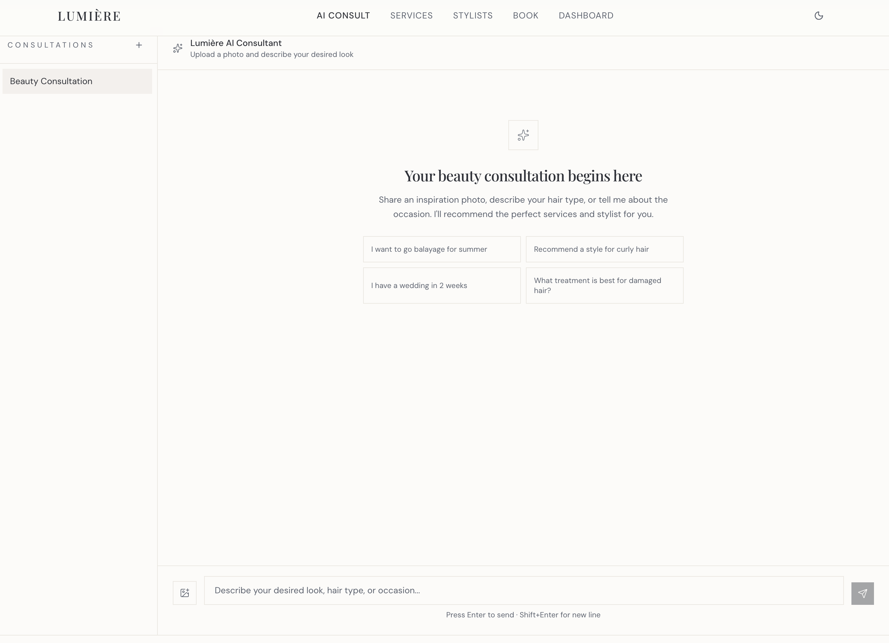
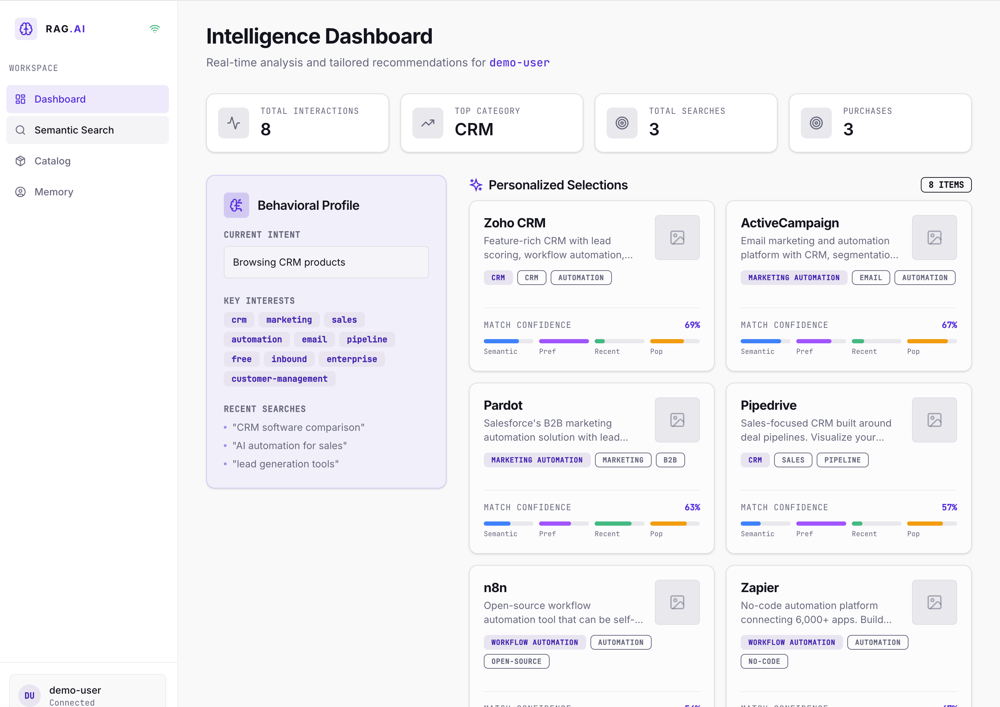

# 👋 Hi, I'm Augustine Ofoegbu

### AI Engineer | Machine Learning Engineer | Generative AI Developer

I build production-grade AI systems that combine Large Language Models (LLMs), Agentic AI, Retrieval-Augmented Generation (RAG), Machine Learning, Computer Vision, and Cloud Infrastructure to solve real-world business problems.
 
My focus areas include:

* 🤖 Agentic AI & Multi-Agent Systems
* 🧠 Large Language Models (LLMs)
* 🔍 Retrieval-Augmented Generation (RAG)
* 🎯 Recommendation & Personalization Systems
* 👁️ Computer Vision & Multi-Modal AI
* ☁️ AWS Cloud Infrastructure
* 🐳 Docker & Kubernetes
* ⚡ FastAPI & Python
  
---

# 🚀 Featured Projects

---

## 1. Agentic AI E-Commerce SaaS Platform

  https://commerce.ogelollm.app

<!-- Add Project Screenshot Here -->

  

### Overview

A production-grade Agentic AI SaaS platform that leveraged multi-agent workflows, task decomposition, memory systems, and tool-calling capabilities to automate complex e-commerce operations.

Uses autonomous AI agents capable of product discovery, customer support, marketing content generation, and business analytics using LLM reasoning loops and Retrieval-Augmented Generation (RAG).

Implements scalable backend services with FastAPI, Docker, Redis, and asynchronous queue processing to support high-volume production workloads.

AgentCore is a multi-agent AI-powered e-commerce command center — a full-stack SaaS platform that gives online store operators an AI team working behind the scenes to research products, handle customers, create marketing content, and surface business insights in real time.

Features
🤖 AI Agents
Five specialized agents you can run on demand:

Orchestrator — coordinates all four agents in a four-step Think → Plan → Act → Reflect loop for complex multi-domain tasks

Product Research — finds and compares products, evaluates trends and competitive positioning

Customer Support — drafts replies and resolves customer inquiries automatically

Marketing Content — generates campaigns, email copy, social posts, and SEO descriptions

Analytics — surfaces KPIs, trends, and actionable business insights

Live execution panel streams each step as it happens, and every run is saved to Task History with expandable results.

💬 AI Chat
A persistent multi-conversation chat interface. Start new threads, ask free-form questions about your store, and get streaming AI responses — all saved across sessions.

📦 Products
A searchable product catalog with category badges, star ratings, and stock levels. Add new products via a validated dialog.

👥 Customers
A customer directory segmented by value tier (VIP / Regular / New). Raise AI-generated support tickets for any customer — the agent reads the issue, drafts a professional response, and logs the ticket automatically.

📋 Orders
Full order list with status counters (Pending / Processing / Shipped / Delivered / Cancelled), expandable line-item details, and inline status updates that reflect immediately in the counter cards.

📣 Marketing
Generate email campaigns, social media posts, SEO copy, and product descriptions with tone and audience controls. Copy results to clipboard, and revisit any past campaign by clicking it in the Recent Campaigns history.

📊 Analytics
Daily revenue and order volume charts, top-line KPI metrics, and an AI Insights generator that produces an executive summary, key findings, and prioritized recommendations — configurable by focus area and time window.

🖥️ Dashboard
At-a-glance command center: revenue, orders, customers, and agent run KPIs; a revenue trend area chart; customer segment breakdown; top products by revenue; and a live agent activity feed.

Built on React + Vite + Tailwind + shadcn/ui on the frontend, Express 5 + Drizzle ORM + PostgreSQL on the backend, and OpenAI GPT for all agent intelligence — with real-time SSE streaming throughout.

### Technologies

`Python` `FastAPI` `LangGraph` `LangChain` `OpenAI` `Redis` `PostgreSQL` `Docker` `AWS`

### Key Features

* Multi-agent orchestration
* Task decomposition
* Tool calling
* Memory systems
* Autonomous workflows
* RAG-powered responses
* Async job processing

---

## 2. Customer Support LLM Agent

  https://supportbot.ogelollm.app

<!-- Add Project Screenshot Here -->

  

### Overview

An AI-powered customer support platform that automated ticket classification, issue resolution, and intelligent escalation using Large Language Models and NLP techniques.

Implements Retrieval-Augmented Generation (RAG), confidence-based decision making, and human-in-the-loop workflows to safely resolve customer inquiries while reducing support workload.

The system integrates with SaaS tools such as CRM, billing, and ticketing platforms using FastAPI-based microservices and cloud-native deployment practices.

SupportAI is a full-stack AI-powered customer support platform that handles incoming support requests automatically — classifying, resolving, and escalating them without human intervention where possible.

Customer Support Portal
Customers chat directly with an AI assistant powered by gpt-5-mini. The AI streams responses in real time, draws on the knowledge base to answer questions accurately, and automatically flags complex or high-risk issues for human review.

Ticket Management
Every chat or submitted issue becomes a ticket. Agents can view all tickets in a filterable table — searchable by keyword, filterable by status and category. Each ticket shows the AI's classification, confidence score, and generated response. Agents can escalate tickets with notes or mark them resolved.

AI Classification & Auto-Resolution
When a ticket is created, a single AI call classifies its category (billing, technical, account, product, bug) and priority (low → urgent), assesses its confidence, and attempts an answer using the knowledge base. Tickets with confidence ≥ 80% and a valid answer are auto-resolved instantly. Lower confidence or high-risk topics (billing disputes, security) are escalated to a human agent.

Knowledge Base
A searchable library of help articles that feeds directly into the AI's context window. Agents can create, edit, and delete articles. The more articles exist, the better the AI's resolution accuracy. Supports category tagging and keyword tags.

Agent Dashboard
Live metrics at a glance: total tickets, open/auto-resolved/escalated/closed counts, AI auto-resolution rate, average confidence score, and a bar chart breaking ticket volume down by category.

Built with React + Express, PostgreSQL for storage, and gpt-5-mini for cost-efficient AI — no vector database required.

### Technologies

`Python` `FastAPI` `OpenAI` `RAG` `PostgreSQL` `Redis` `Docker` `AWS`

### Key Features

* Ticket classification
* Auto-resolution workflows
* Human-in-the-loop escalation
* CRM integration
* Billing system integration
* Knowledge base retrieval
* SaaS automation

---

## 3. Multi-Modal AI Beauty & Salon Intelligence Platform

  https://beauty.ogelollm.app

<!-- Add Project Screenshot Here -->

  

### Overview

A multimodal AI platform that combined computer vision and natural language processing to provide personalized beauty, wellness, and salon service recommendations from both image and text inputs.

Some of the features include AI-powered consultation, stylist matching, and booking optimization features using vision-language models, recommendation systems, and conversational AI.

Other features include demand forecasting, appointment optimization, and customer personalization capabilities to improve booking conversion, operational efficiency, and user experience for salon and wellness businesses.

Lumière is a luxury AI-powered beauty and salon management platform. Here's what it does:

AI Consultant — a multimodal chat interface where clients describe their desired look, upload a photo of their current hair, and get personalized service recommendations from an AI beauty expert. After each response, they can generate a visual style preview image (via Pollinations.ai) to see their look before committing.

Services — a browsable catalog of 10 salon offerings (cuts, color, balayage, keratin treatments, facials, etc.) with pricing and duration.

Stylists — profiles for 4 in-house stylists with their specialties displayed.

Book — a 4-step appointment booking flow: pick a service, choose a stylist, select a date and time, fill in your details, and confirm. Appointments are saved to the database.

Dashboard — an analytics view for salon owners showing revenue trends, appointment counts, top services by demand, and a list of upcoming appointments — all rendered as interactive charts.

The design is minimalist luxury: Playfair Display serif headings, champagne tones, clean whitespace, and smooth Framer Motion animations throughout. There's also a dark mode toggle in the nav. The backend is a Node/Express API backed by PostgreSQL.

### Technologies

`Computer Vision` `OpenAI` `Vision Models` `FastAPI` `Python` `AWS` `Docker`

### Key Features

* Image + text understanding
* Beauty consultation assistant
* Stylist matching
* Booking optimization
* Demand forecasting
* Personalized recommendations
* Multi-modal AI workflows

---

## 4. RAG + Personalization Engine

  https://recommender.ogelollm.app

<!-- Add Project Screenshot Here -->

  

### Overview

A personalized recommendation engine that combined Retrieval-Augmented Generation, vector embeddings, semantic search, and behavioral memory to deliver context-aware recommendations.

Uses a hybrid PostgreSQL and vector database architecture to store long-term user preferences, interaction history, and semantic embeddings for real-time personalization.

The system uses improved recommendation relevance through ranking optimization techniques that incorporated user behavior, recency signals, semantic similarity, and engagement metrics.

RAG Personalization Engine is a full-stack demo that shows how modern AI recommendation systems work — combining semantic search, behavioral memory, and generative AI to surface the right SaaS products for a specific user.

Core features:

Dashboard — personalized home screen showing AI-ranked product recommendations with a 4-component score breakdown (semantic match, user preference, recency, popularity). GPT-4o-mini writes a one-sentence explanation for each recommendation based on the user's history.

Behavioral Profile — a sidebar panel on the dashboard that shows the engine's real-time read of the user: current intent, learned interests (derived from tags across all interactions), and recent searches from the last 24 hours.

Semantic Search — natural language product search powered by TF-IDF cosine similarity. Results are re-ranked by the user's behavioral history so frequent CRM users see CRM-adjacent results boosted higher.

Product Catalog — all 24 products across 8 categories (CRM, Marketing Automation, Analytics, AI Tools, Workflow Automation, Customer Support, Project Management) with a category filter. Every click, view, purchase, and rating is logged as a behavioral event.

Product Detail — shows full product info and lets you simulate interactions (view, click, purchase, rating). Each interaction updates the recommendation engine in real time. A "Similar Recommendations" panel at the bottom uses the same scoring engine.

Memory — visualizes what the engine knows about the user split into short-term memory (current session activity, recent searches, inferred intent) and long-term memory (preferred categories ranked by weighted engagement, learned interests, total interactions, event breakdown by type).

The scoring formula is: 40% semantic similarity to user interest profile + 30% behavioral preference score + 20% recency-adjusted popularity + 10% global popularity score.

### Technologies

`Python` `OpenAI Embeddings` `Pinecone` `pgvector` `PostgreSQL` `FastAPI`

### Key Features

* Semantic search
* Vector embeddings
* Personalized recommendations
* Behavioral memory
* Ranking optimization
* Long-term user profiles
* RAG architecture

---

# 🛠 Technical Skills

### AI / Machine Learning

* Large Language Models (LLMs)
* Agentic AI
* Retrieval-Augmented Generation (RAG)
* NLP
* Deep Learning
* Computer Vision
* Recommendation Systems
* Embeddings & Vector Search

### Programming

* Python
* SQL
* FastAPI

### Cloud & DevOps

* AWS
* Docker
* Kubernetes
* CI/CD
* GitHub Actions

### Databases

* PostgreSQL
* Redis
* Pinecone
* ChromaDB
* pgvector

---

# 📈 What I'm Currently Exploring

* Multi-Agent AI Systems
* Autonomous AI Workflows
* AI-Powered SaaS Applications
* Vision-Language Models (VLMs)
* Advanced RAG Architectures
* LLM Evaluation & Optimization

---

### 📫 Let's Connect

* LinkedIn: https://www.linkedin.com/in/augustine-ofoegbu-3b899915a/
* Portfolio: https://github.com/aofoegbu
* Email: [augustineogelo1@gmail.com](mailto:augustineogelo1@gmail.com)

⭐ Feel free to explore my repositories and connect with me if you're interested in AI, Machine Learning, or Generative AI.
